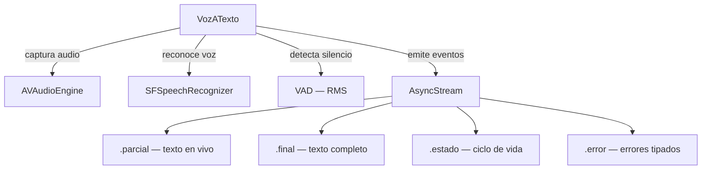

<div align="center">

# ControlXVoz

**Speech-to-text package for the Apple ecosystem.**  
Built on `SFSpeechRecognizer` and `AVFoundation`. No external dependencies.

[](https://swift.org)
[](https://developer.apple.com)
[](https://swift.org/package-manager)
[](LICENSE)

</div>

---

## ¿Por qué ControlXVoz?

| | ControlXVoz | SFSpeechRecognizer directo |
|---|:---:|:---:|
| Zero dependencias | ✅ | ✅ |
| async/await nativo | ✅ | ❌ |
| AsyncStream de eventos | ✅ | ❌ |
| Actor model (Swift 6) | ✅ | ❌ |
| VAD — auto-detención por silencio | ✅ | ❌ |
| Timeout máximo automático | ✅ | ❌ |
| Errores tipados | ✅ | ❌ |
| Solo ecosistema Apple | ✅ | ✅ |

---

## Instalación

### Swift Package Manager

**Xcode:** File → Add Package Dependencies →

```
https://github.com/BurgerMike/ControlXVoz.git
```

**Package.swift:**

```swift
dependencies: [
    .package(url: "https://github.com/BurgerMike/ControlXVoz.git", from: "1.0.0")
],
targets: [
    .target(name: "MiApp", dependencies: ["ControlXVoz"])
]
```

---

## Permisos requeridos

Agrega estas claves en tu `Info.plist`:

```xml
<key>NSMicrophoneUsageDescription</key>
<string>Necesitamos el micrófono para escuchar tus comandos de voz.</string>

<key>NSSpeechRecognitionUsageDescription</key>
<string>Usamos reconocimiento de voz para convertir tus palabras en texto.</string>
```

---

## Inicio rápido

```swift
import ControlXVoz

// 1. Crea el servicio (una vez, en tu capa de lógica)
let servicio = VozATexto()

// 2. Pide permisos y habilita
await servicio.habilitar()

// 3. Escucha los eventos
Task {
    for await evento in servicio.eventos {
        switch evento {
        case .final(let texto):
            print("Dijiste: \(texto)")
        case .parcial(let texto):
            print("Escuchando: \(texto)")
        case .estado(let estado):
            print("Estado: \(estado)")
        case .error(let error):
            print("Error: \(error.localizedDescription)")
        }
    }
}

// 4. Inicia la escucha
try await servicio.iniciar()
```

---

## Guía de uso

### Configuración

`ConfigVozATexto` controla el comportamiento del reconocedor. Todos los valores tienen defaults listos para usar.

```swift
// Configuración por defecto — listo para usar
let servicio = VozATexto()

// Configuración personalizada
let config = ConfigVozATexto(
    localeIdentifier: "es-MX",          // idioma del reconocedor
    reportarParciales: true,             // texto en vivo mientras hablas
    tiempoSilencioParaAutoDetener: 1.5,  // segundos de silencio para auto-detener
    requiereOnDevice: false,             // true = procesamiento local sin internet
    umbralRMSVAD: 0.06                   // sensibilidad del detector de voz
)

let servicio = VozATexto(config: config)
```

---

### Eventos

Todos los eventos llegan por un único `AsyncStream<EventoVozATexto>`.

```swift
for await evento in servicio.eventos {
    switch evento {

    case .estado(let estado):
        // El servicio cambió de estado — úsalo para actualizar la UI
        switch estado {
        case .inactivo:     ocultarIndicador()
        case .listo:        mostrarBotonIniciar()
        case .escuchando:   mostrarAnimacionEscucha()
        case .finalizado:   break
        case .error:        break
        }

    case .parcial(let texto):
        // Texto en vivo — llega muchas veces mientras hablas
        // Ideal para mostrar subtítulos en tiempo real
        labelSubtitulo.text = texto

    case .final(let texto):
        // Texto completo y confirmado — llega UNA sola vez
        // Aquí procesas el comando o la pregunta del usuario
        procesarComando(texto)

    case .error(let error):
        // Error tipado — manéjalo según el caso
        manejarError(error)
    }
}
```

---

### Estados

```
inactivo → listo → escuchando → finalizado
                       ↓
                     error
```

| Estado | Cuándo ocurre |
|---|---|
| `.inactivo` | Servicio apagado o sin habilitar |
| `.listo` | Permisos concedidos, listo para iniciar |
| `.escuchando(textoParcial:)` | Micrófono activo, reconociendo voz |
| `.finalizado(texto:)` | Texto completo entregado |
| `.error(String)` | Algo salió mal |

---

### Manejo de errores

Todos los errores son de tipo `ErrorVozATexto` con mensajes listos para mostrar al usuario.

```swift
case .error(let error):
    switch error {
    case .noConfigurado:
        // Llamaste iniciar() sin llamar habilitar() antes
        print(error.localizedDescription)

    case .permisosDenegados:
        // El usuario negó micrófono o speech
        mostrarAlerta("Ve a Ajustes para habilitar el micrófono.")

    case .noDisponible:
        // Speech no disponible en este dispositivo o idioma
        mostrarAlerta("Reconocimiento de voz no disponible.")

    case .falloAudio:
        // Problema con el motor de audio
        mostrarAlerta("Error de audio. Intenta de nuevo.")

    case .cancelado:
        // Cancelación intencional — no es un error real
        break

    case .desconocido(let mensaje):
        print("Error inesperado: \(mensaje)")
    }
```

#### Tabla de errores

| Caso | Cuándo ocurre |
|---|---|
| `.noConfigurado` | Se llamó `iniciar()` sin `habilitar()` |
| `.permisosDenegados` | El usuario negó micrófono o speech |
| `.noDisponible` | Speech no disponible para el locale configurado |
| `.falloAudio` | Error en el motor de audio de AVFoundation |
| `.cancelado` | Cancelación explícita por la app o el usuario |
| `.desconocido` | Error no clasificado de SFSpeechRecognizer |

---

### Ciclo de vida completo

```swift
// Habilitar — llama esto al iniciar tu app o scene
await servicio.habilitar()

// Iniciar escucha — el usuario presiona el botón
try await servicio.iniciar()

// Cancelar — el usuario cancela o cambia de pantalla
await servicio.cancelar()

// Deshabilitar — al cerrar la app o salir del contexto
await servicio.deshabilitar()
```

---

### Integración con SwiftUI

```swift
import SwiftUI
import ControlXVoz

@Observable
final class VozViewModel {

    let servicio = VozATexto()
    var textoActual = ""
    var estaEscuchando = false

    func iniciar() async {
        await servicio.habilitar()

        Task {
            for await evento in servicio.eventos {
                switch evento {
                case .parcial(let texto):
                    textoActual = texto
                case .final(let texto):
                    textoActual = texto
                    estaEscuchando = false
                case .estado(let estado):
                    if case .escuchando = estado { estaEscuchando = true }
                case .error:
                    estaEscuchando = false
                }
            }
        }

        try? await servicio.iniciar()
    }

    func cancelar() async {
        await servicio.cancelar()
        estaEscuchando = false
    }
}

struct VozView: View {
    @State private var vm = VozViewModel()

    var body: some View {
        VStack(spacing: 24) {
            Text(vm.textoActual.isEmpty ? "Presiona para hablar" : vm.textoActual)
                .font(.title2)

            Button(vm.estaEscuchando ? "Cancelar" : "Hablar") {
                Task {
                    if vm.estaEscuchando {
                        await vm.cancelar()
                    } else {
                        await vm.iniciar()
                    }
                }
            }
            .buttonStyle(.borderedProminent)
        }
        .padding()
    }
}
```

---

## Arquitectura del package

```
🎙️ Micrófono (AVAudioEngine)
       ↓ audio crudo
🧠 Speech (SFSpeechRecognizer)
       ↓ texto
📡 AsyncStream<EventoVozATexto>
       ↓ eventos tipados
🖥️ Tu app
```



| Archivo | Responsabilidad |
|---|---|
| `VozATexto` | Actor principal. Orquesta audio, speech y VAD. |
| `ConfigVozATexto` | Parámetros del reconocedor: idioma, silencio, RMS. |
| `EventoVozATexto` | Eventos tipados que llegan por el AsyncStream. |
| `EstadoVozATexto` | Ciclo de vida del servicio para actualizar la UI. |
| `ErrorVozATexto` | Errores tipados con mensajes listos para mostrar. |

---

## Preguntas frecuentes

**¿Funciona sin internet?**  
Sí, si configuras `requiereOnDevice: true`. El reconocimiento on-device es más privado pero puede ser menos preciso que el procesamiento en servidores de Apple.

**¿Cuánto tiempo escucha antes de auto-detenerse?**  
Por silencio: mínimo 1.8 segundos (configurable con `tiempoSilencioParaAutoDetener`). Por timeout máximo: 45 segundos sin importar el silencio.

**¿Es thread-safe?**  
Sí. `VozATexto` es un `actor` de Swift 6 — todas sus propiedades están protegidas automáticamente. Compatible con strict concurrency.

**¿Funciona en iOS y macOS?**  
Sí, en iOS 17+ y macOS 14+. La sesión de `AVAudioSession` solo se activa en iOS — en macOS no es necesaria.

**¿Puedo cambiar el idioma en tiempo real?**  
No directamente. Crea un nuevo `VozATexto` con una `ConfigVozATexto` diferente para cambiar el idioma.

---

## Requisitos

| Plataforma | Versión mínima |
|---|---|
| iOS | 17.0 |
| macOS | 14.0 |
| Swift | 6.0 |

---

## Licencia

MIT — ver [LICENSE](LICENSE) para más detalles.
